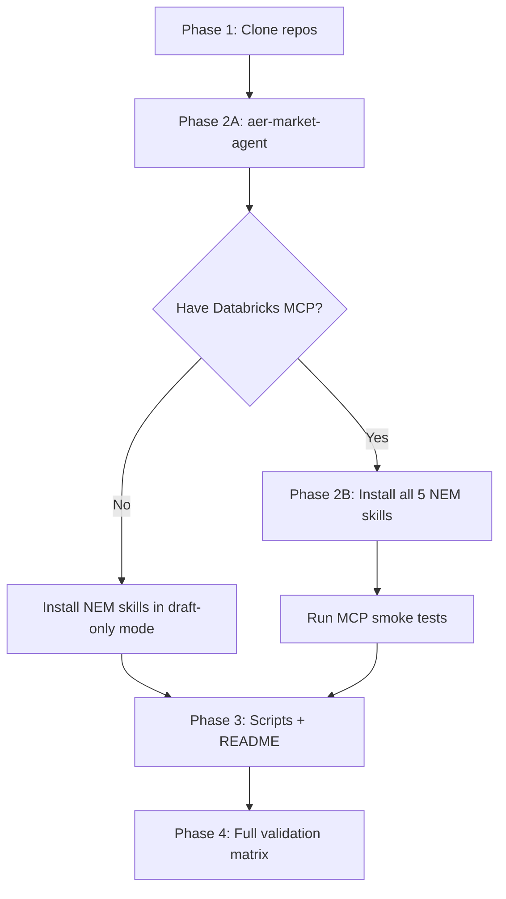

# Renovara Module Download & Implementation Plan

> Generated: 2026-06-12  
> Target workspace: `/Users/walter/Documents/Claude/Projects/Renovara`  
> Source org: [github.com/Renovara](https://github.com/Renovara/)

---

## Executive summary

The [Renovara GitHub organisation](https://github.com/Renovara/) currently exposes **2 public repositories** containing **7 distinct skill/agent modules** (6 under `agents`, 1 standalone). This workspace is empty and should become a **local aggregation hub** for cloning, installing, configuring, and validating all Renovara OSS modules.

There is also a **private upstream** (Databricks Genie-space pipeline repo) that generates the NEM SQL skills. That repo is not publicly downloadable; treat the GitHub releases as the distribution source of truth.

---

## Inventory

### Public repositories

| Repo | Clone URL | Language | Last updated | Role |
|------|-----------|----------|--------------|------|
| [agents](https://github.com/Renovara/agents) | `https://github.com/Renovara/agents.git` | Python (scripts in `aer-market-agent`) | 2026-06-09 | Umbrella repo — 6 skills under `skills/` + release zips |
| [nem-analyst-skill](https://github.com/Renovara/nem-analyst-skill) | `https://github.com/Renovara/nem-analyst-skill.git` | Markdown/YAML | 2026-03-13 | Standalone distributable of the general NEM analyst skill |

### Modules inside `Renovara/agents`

| Module | Type | Databricks MCP required? | Release zip (v0.2.0) |
|--------|------|--------------------------|----------------------|
| `aer-market-agent` | Python + bundled CSV/JSON data | **No** — fully offline | `aer-market-agent.zip` |
| `renovara_ai_nem_analyst` | AI skill (SKILL.md + schema YAML) | **Yes** | `renovara_ai_nem_analyst.zip` |
| `renovara_duid_report_detailed` | AI skill | **Yes** | `renovara_duid_report_detailed.zip` |
| `renovara_duid_renewable_report_detailed` | AI skill | **Yes** | `renovara_duid_renewable_report_detailed.zip` |
| `renovara_duid_constraint_analysis` | AI skill | **Yes** | `renovara_duid_constraint_analysis.zip` |
| `renovara_fcas_analyst` | AI skill | **Yes** | `renovara_fcas_analyst.zip` |

### Module in `Renovara/nem-analyst-skill`

| Module | Notes |
|--------|-------|
| `nem-analyst/` | Functionally overlaps `renovara_ai_nem_analyst`; standalone repo for sync/install. Release: `nem-analyst-v0.1.0.zip` |

### External / private dependencies (not on GitHub)

| Dependency | Purpose | Action |
|------------|---------|--------|
| Renovara Databricks SQL MCP server | Execute live SQL against `external_data.nemweb` | Request credentials + MCP config from Renovara team |
| Private Databricks pipeline repo | Source Genie spaces that generate skills | Not needed for OSS use; skills ship pre-built |

---

## Recommended target layout

Use a **monorepo-style workspace** that keeps upstream repos as git submodules (or sibling clones) and links skills into your AI platform:

```
Renovara/
├── DOWNLOAD_AND_IMPLEMENTATION_PLAN.md   # this file
├── README.md                             # workspace overview + quick commands
├── .env.example                          # Databricks MCP placeholders
├── scripts/
│   ├── clone-all.sh                      # clone submodules / repos
│   ├── install-skills.sh                 # symlink skills → ~/.cursor/skills or ~/.claude/skills
│   └── verify.sh                         # smoke tests per module
├── repos/
│   ├── agents/                           # git submodule → Renovara/agents
│   └── nem-analyst-skill/                # git submodule → Renovara/nem-analyst-skill
├── skills/                               # installed skill targets (symlinks or copies)
│   ├── aer-market-agent -> ../repos/agents/skills/aer-market-agent
│   ├── renovara_ai_nem_analyst -> ...
│   ├── renovara_duid_report_detailed -> ...
│   ├── renovara_duid_renewable_report_detailed -> ...
│   ├── renovara_duid_constraint_analysis -> ...
│   ├── renovara_fcas_analyst -> ...
│   └── nem-analyst -> ../repos/nem-analyst-skill/nem-analyst
└── releases/                             # optional: cached release zips (v0.2.0)
```

**Note on overlap:** Keep `renovara_ai_nem_analyst` (from `agents`) as the canonical NEM general analyst unless you explicitly prefer the standalone `nem-analyst-skill` repo. Do not install both under the same skill name.

---

## Phase 1 — Download (Day 0)

### 1.1 Initialise workspace

```bash
cd /Users/walter/Documents/Claude/Projects/Renovara
git init
mkdir -p repos skills releases scripts
```

### 1.2 Clone public repos

**Option A — Git submodules (recommended for tracking upstream):**

```bash
git submodule add https://github.com/Renovara/agents.git repos/agents
git submodule add https://github.com/Renovara/nem-analyst-skill.git repos/nem-analyst-skill
git submodule update --init --recursive
```

**Option B — Plain clones (simpler, no submodule overhead):**

```bash
git clone https://github.com/Renovara/agents.git repos/agents
git clone https://github.com/Renovara/nem-analyst-skill.git repos/nem-analyst-skill
```

### 1.3 Pin to latest releases (optional checksum cache)

Download release assets from [agents v0.2.0](https://github.com/Renovara/agents/releases/tag/v0.2.0):

```bash
RELEASE=v0.2.0
BASE=https://github.com/Renovara/agents/releases/download/$RELEASE
for zip in aer-market-agent renovara_ai_nem_analyst renovara_duid_constraint_analysis \
           renovara_duid_renewable_report_detailed renovara_duid_report_detailed renovara_fcas_analyst; do
  curl -L -o "releases/${zip}.zip" "$BASE/${zip}.zip"
done

# nem-analyst-skill standalone release
curl -L -o releases/nem-analyst-v0.1.0.zip \
  https://github.com/Renovara/nem-analyst-skill/releases/download/v0.1.0/nem-analyst-v0.1.0.zip
```

Use zips for **offline/air-gapped installs**; use git clones for **development and diffing against upstream**.

### 1.4 Verify download integrity

```bash
# Expect 6 skill directories under agents
ls repos/agents/skills/

# Expect nem-analyst folder
ls repos/nem-analyst-skill/nem-analyst/

# Each NEM skill should have SKILL.md + references/schema-index.md
find repos/agents/skills -name SKILL.md
test -f repos/nem-analyst-skill/nem-analyst/SKILL.md && echo OK
```

---

## Phase 2 — Install per module (Day 1)

### Module A: `aer-market-agent` (no MCP — start here)

**What it does:** Builds AER Default Market Offer PowerPoint reports from bundled local data; includes a searchable catalog of AER *State of the Energy Market* workbooks.

**Install:**

```bash
cd repos/agents/skills/aer-market-agent
python3 -m venv .venv
source .venv/bin/activate
pip install python-pptx matplotlib openpyxl
```

**Smoke test:**

```bash
python scripts/build_report.py --out /tmp/DMO-Report.pptx
python scripts/query.py domains
python scripts/query.py search "network revenue"
```

**Cursor/Claude skill install:**

```bash
ln -sf "$(pwd)" ~/.cursor/skills/aer-market-agent
# or: ~/.claude/skills/aer-market-agent
```

**Success criteria:** PPTX generated; oracle queries return catalog hits.

---

### Modules B–F: NEM Databricks skills (MCP-dependent)

These five modules share the same integration pattern:

| Module | Primary use case |
|--------|------------------|
| `renovara_ai_nem_analyst` | General NEM market analysis (prices, dispatch, constraints) |
| `renovara_duid_report_detailed` | Individual dispatch unit (DUID) performance |
| `renovara_duid_renewable_report_detailed` | Wind/solar DUID performance |
| `renovara_duid_constraint_analysis` | Forced vs economic curtailment |
| `renovara_fcas_analyst` | FCAS participation and outcomes |

**Install (each skill):**

```bash
SKILL=renovara_ai_nem_analyst  # repeat for each
ln -sf "$(pwd)/repos/agents/skills/$SKILL" ~/.cursor/skills/$SKILL
```

**Required MCP tools** (Renovara Databricks SQL server):

- `mcp__renovara-sql__execute_sql_read_only`
- `mcp__renovara-sql__execute_sql`
- `mcp__renovara-sql__poll_sql_result`

**Cursor MCP config** (template — fill in from Renovara):

```json
{
  "mcpServers": {
    "renovara-sql": {
      "command": "<provided-by-renovara>",
      "args": ["<...>"],
      "env": {
        "DATABRICKS_HOST": "<workspace-url>",
        "DATABRICKS_TOKEN": "<token>"
      }
    }
  }
}
```

**Smoke test prompt** (once MCP is live):

```
Show average NSW1 RRP by hour for the last 7 days.
```

**Success criteria:** Assistant opens `references/schema-index.md`, selects a YAML schema, executes SQL via MCP, returns chart-ready data.

**Degraded mode (no MCP):** Skills still provide schema routing and SQL drafts — document this limitation in workspace README.

---

### Module G: `nem-analyst` (standalone repo)

**Decision:** Install **only if** you want the standalone repo layout or to track `nem-analyst-skill` releases separately from `agents`.

```bash
ln -sf "$(pwd)/repos/nem-analyst-skill/nem-analyst" ~/.cursor/skills/nem-analyst
```

Same MCP requirements as `renovara_ai_nem_analyst`. **Do not** symlink both under active skill paths simultaneously.

---

## Phase 3 — Workspace integration (Day 2)

### 3.1 Root README

Create `README.md` with:

- Module inventory table (this plan, abbreviated)
- One-command clone + install instructions
- MCP setup pointer
- Per-module smoke-test commands

### 3.2 Environment template

Create `.env.example`:

```
DATABRICKS_HOST=
DATABRICKS_TOKEN=
DATABRICKS_CATALOG=external_data
DATABRICKS_SCHEMA=nemweb
```

Never commit real tokens.

### 3.3 Automation scripts

| Script | Purpose |
|--------|---------|
| `scripts/clone-all.sh` | Clone/submodule init both repos |
| `scripts/install-skills.sh` | Symlink all 6 agents skills + optional nem-analyst |
| `scripts/verify.sh` | Run aer-market-agent smoke test; check SKILL.md presence for NEM skills |

### 3.4 Update strategy

```bash
# Pull latest agents
cd repos/agents && git pull && cd ../..

# Check for new releases
gh release list -R Renovara/agents
gh release list -R Renovara/nem-analyst-skill

# Re-run install-skills.sh if skill folders changed
```

---

## Phase 4 — Validation matrix

| Module | Offline test | Live test | Blocker if missing |
|--------|-------------|-----------|-------------------|
| `aer-market-agent` | `build_report.py`, `query.py` | Optional: `fetch_data.py --all` | None |
| `renovara_ai_nem_analyst` | Read `schema-index.md`, draft SQL | MCP SQL query | Databricks MCP |
| `renovara_duid_report_detailed` | Schema + example SQL review | DUID query via MCP | Databricks MCP |
| `renovara_duid_renewable_report_detailed` | Same | Renewable DUID query | Databricks MCP |
| `renovara_duid_constraint_analysis` | Same | Curtailment report SQL | Databricks MCP |
| `renovara_fcas_analyst` | Same | FCAS query | Databricks MCP |
| `nem-analyst` | Same as nem analyst | Same | Databricks MCP |

---

## Implementation order (recommended)



1. **First:** `aer-market-agent` — immediate value, zero external deps  
2. **Second:** Install all NEM skill symlinks (works for SQL drafting immediately)  
3. **Third:** Configure Renovara Databricks SQL MCP  
4. **Fourth:** Run live NEM smoke tests  
5. **Optional:** Decide whether to keep `nem-analyst-skill` as a separate submodule or rely solely on `agents`

---

## Gaps & prerequisites checklist

Before marking implementation complete, confirm:

- [ ] GitHub access to both public repos (no auth needed for public clone)
- [ ] Python 3.10+ for `aer-market-agent`
- [ ] `python-pptx`, `matplotlib`, `openpyxl` installed
- [ ] Renovara Databricks workspace URL + token (for live NEM queries)
- [ ] MCP server package/config from Renovara team
- [ ] Cursor skills directory path decided (`~/.cursor/skills/` vs project-local)
- [ ] Policy on `nem-analyst` vs `renovara_ai_nem_analyst` duplication

---

## One-shot bootstrap command block

Run from an empty `Renovara/` workspace:

```bash
#!/usr/bin/env bash
set -euo pipefail
ROOT="$(pwd)"

mkdir -p repos skills releases scripts

# Clone
git clone https://github.com/Renovara/agents.git repos/agents
git clone https://github.com/Renovara/nem-analyst-skill.git repos/nem-analyst-skill

# aer-market-agent venv
cd repos/agents/skills/aer-market-agent
python3 -m venv .venv && source .venv/bin/activate
pip install python-pptx matplotlib openpyxl
cd "$ROOT"

# Symlink skills (adjust SKILLS_DIR for your platform)
SKILLS_DIR="${SKILLS_DIR:-$HOME/.cursor/skills}"
mkdir -p "$SKILLS_DIR"
for skill in aer-market-agent renovara_ai_nem_analyst renovara_duid_report_detailed \
             renovara_duid_renewable_report_detailed renovara_duid_constraint_analysis \
             renovara_fcas_analyst; do
  ln -sfn "$ROOT/repos/agents/skills/$skill" "$SKILLS_DIR/$skill"
done

echo "Done. Next: configure Renovara Databricks SQL MCP, then test NEM skills."
```

---

## References

- [Renovara GitHub org](https://github.com/Renovara/)
- [agents README](https://github.com/Renovara/agents/blob/main/README.md)
- [agents releases v0.2.0](https://github.com/Renovara/agents/releases/tag/v0.2.0)
- [nem-analyst-skill README](https://github.com/Renovara/nem-analyst-skill/blob/main/README.md)
- [Renovara website](https://renovara.co) — commercial NEM platform (separate from OSS skills)
